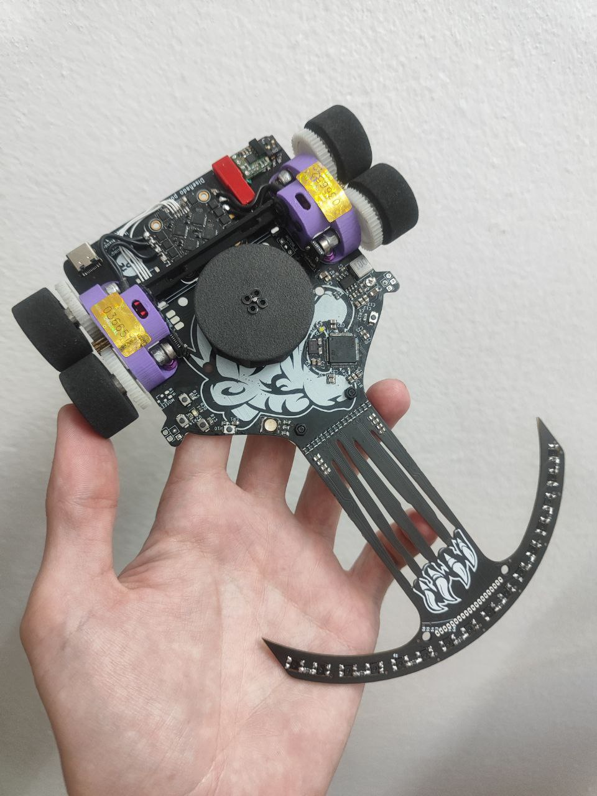
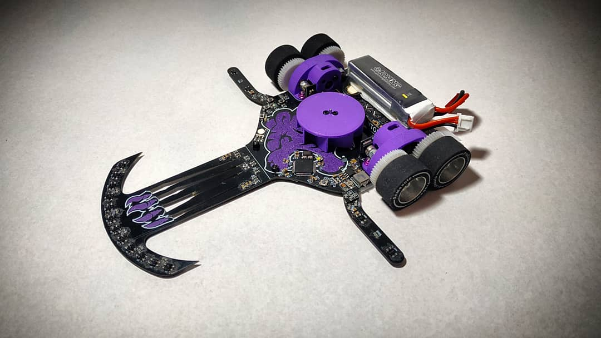

# FujitoraBot
Robot siguelineas con motores brushless, succión centrifuga y STM32F4

## Hardware
- STM32F405RGT6
- ESC 4in1 BlHeli 14A
- 2x Motores Brushless 1306
- 1x Motor brushless 1104 (succión)
- DIP Switch 2p SMD
- LiPo 3S 380 mAh
- 16x sensores QRE1113
- Ruedas Scaleauto Procomp 1
- Chasis de PCB con soportes de motores y ventilador en PLA

## Software
- Programado con VSCode y PlatformIO con LibOpenCM3
- Disponibles programas básicos de seguir pared derecha/izquierda

### Versión Robotracer

